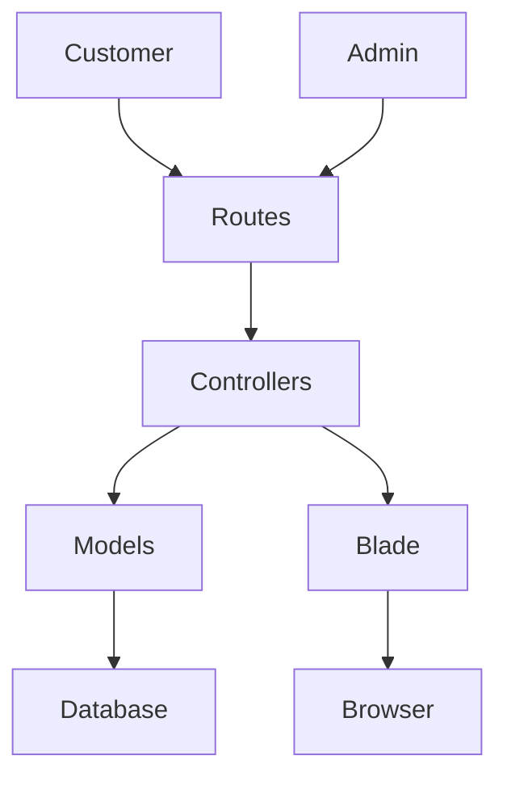
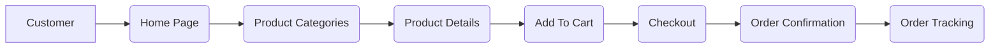
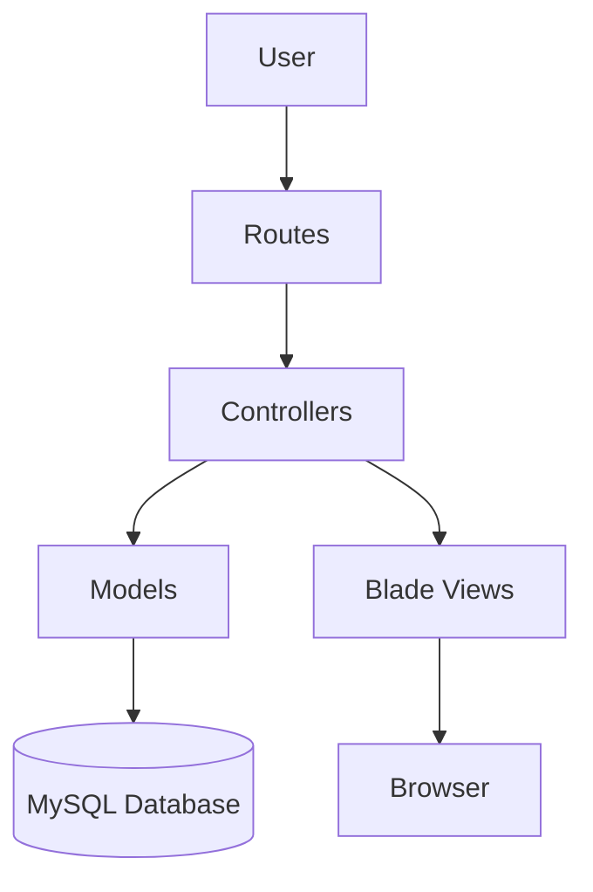

<a id="top"></a>

<div align="center">

# 🛒 SuperMarket E-Commerce Platform

### Modern Laravel Full-Stack Grocery Shopping System

<p>
A professional supermarket platform built with Laravel, providing customers with a modern shopping experience and administrators with a powerful management dashboard.
</p>

<br>


<br><br>


<br>


</div>

---

# 🌿 About

SuperMarket is a modern Laravel-based E-Commerce platform that simulates a real-world online supermarket.

The project focuses on clean architecture, scalability, maintainability, and an intuitive shopping experience while following Laravel best practices.

It includes both customer and administrator modules, allowing complete management of products, inventory, categories, orders, and users through a modern dashboard.

---

# 🚀 Quick Navigation

- 🌟 About
- ✨ Features
- 🛠 Tech Stack
- 📂 Project Structure
- ⚙ Installation
- 📈 Roadmap
- 👨‍💻 Developer

---

# ✨ Main Features

<div align="center">

| 🛍 Shopping | 👤 Customer | 👑 Admin |
|:----------:|:----------:|:-------:|
| Product Catalog | User Profile | Dashboard |
| Categories | Wishlist | Products |
| Brands | Shopping Cart | Categories |
| Product Details | Orders | Brands |
| Search | Order Tracking | Customers |
| Filters | Addresses | Orders |
| Related Products | Checkout | Reports |

</div>

---

# 🛒 Shopping Features

<table>

<tr>

<td width="50%">

## 📦 Products

- Browse Products

- Featured Products

- Product Details

- Related Products

- Product Images

- Product Variants

</td>

<td width="50%">

## 🔍 Search

- Smart Search

- Category Filter

- Brand Filter

- Price Filter

- Product Sorting

</td>

</tr>

<tr>

<td>

## ❤️ Customer

- Shopping Cart

- Wishlist

- User Account

- Address Management

- Checkout

</td>

<td>

## 📋 Orders

- Place Orders

- Order History

- Order Tracking

- Invoice

- Order Status

</td>

</tr>

</table>

---

# 👑 Admin Dashboard

<table>

<tr>

<td align="center">

### 📦

Product Management

</td>

<td align="center">

### 🏷

Category Management

</td>

<td align="center">

### 🏢

Brand Management

</td>

</tr>

<tr>

<td align="center">

### 👥

Customer Management

</td>

<td align="center">

### 📋

Order Management

</td>

<td align="center">

### 📊

Analytics Dashboard

</td>

</tr>

<tr>

<td align="center">

### ⭐

Reviews

</td>

<td align="center">

### 🎟

Coupons

</td>

<td align="center">

### 📦

Inventory

</td>

</tr>

</table>

---

# 💚 Why This Project?

✔ Modern UI

✔ Clean Laravel Architecture

✔ Secure Authentication

✔ Responsive Layout

✔ Easy Navigation

✔ Scalable Structure

✔ Optimized Database Design

✔ RESTful Routing

✔ MVC Pattern

✔ Reusable Components

---

# 🛠 Tech Stack

<div align="center">


</div>

| Technology | Purpose |
|------------|---------|
| Laravel | Backend Framework |
| PHP | Server-side Development |
| MySQL | Database |
| Blade | Templating Engine |
| Bootstrap | UI Framework |
| HTML5 | Markup |
| CSS3 | Styling |
| JavaScript | Client-side |
| Git | Version Control |
| GitHub | Source Code Hosting |

---

# 📂 Project Structure

```text
SuperMarket
│
├── app
├── bootstrap
├── config
├── database
├── public
├── resources
│   ├── css
│   ├── js
│   ├── views
│
├── routes
├── storage
├── tests
├── vendor
└── .env
```

---

# 🏗 Architecture



---

# 🔒 Security

- CSRF Protection
- Password Hashing
- Authentication
- Authorization
- Request Validation
- Middleware Protection
- Secure Sessions

---

<div align="center">

## ⭐ Building a Real-World Laravel Shopping Experience

</div>
---

# ⚙️ Installation Guide

Clone the repository

```bash
git clone https://github.com/Shahd-Ibrahim7/SuperMarket-e-commerce.git
```

Navigate to the project directory

```bash
cd SuperMarket-e-commerce
```

Install project dependencies

```bash
composer install
```

Copy the environment configuration

```bash
cp .env.example .env
```

Generate the application key

```bash
php artisan key:generate
```

Configure your database credentials inside the **.env** file.

Run database migrations

```bash
php artisan migrate
```

(Optional) Seed the database

```bash
php artisan db:seed
```

Start the development server

```bash
php artisan serve
```

Open your browser

```
http://127.0.0.1:8000
```

---

# 📊 System Workflow



---

# 🏗 MVC Architecture



---

# 🎯 Project Objectives

✔ Professional Laravel Architecture

✔ Responsive User Interface

✔ MVC Design Pattern

✔ Secure Authentication

✔ Scalable Database Design

✔ Clean & Maintainable Code

✔ Reusable Components

✔ Optimized Performance

✔ Easy Future Expansion

---

# 🚀 Future Enhancements

<div align="center">

| 💳 Payment | 📱 Mobile | 🤖 AI |
|------------|-----------|-------|
| Stripe Integration | Flutter App | Product Recommendation |
| PayPal | Android | Smart Search |
| Cash On Delivery | iOS | Personalized Offers |

</div>

<br>

<div align="center">

| 🌍 Localization | 📈 Analytics | ⚙ More Features |
|-----------------|--------------|-----------------|
| Arabic & English | Sales Reports | Notifications |
| RTL Support | Charts | Email Verification |
| Multi Language | Dashboard Insights | REST API |

</div>

---

# 📂 Development Principles

- Clean Architecture
- SOLID Principles
- MVC Pattern
- RESTful Routing
- Laravel Best Practices
- Reusable Components
- Organized Folder Structure
- Readable Code
- Database Normalization

---

# 📌 Repository

**GitHub Repository**

https://github.com/Shahd-Ibrahim7/SuperMarket-e-commerce

---

# 👩‍💻 Developer

<div align="center">

# Shahd Ibrahim

### Computer & Data Science Student

**Cybersecurity Specialist**

**Laravel Backend Developer**

Passionate about building scalable web applications using Laravel while following clean architecture and modern development practices.

</div>

---

# 🌟 Support

If you enjoyed this project, consider giving it a ⭐ on GitHub.

It helps support future development and motivates me to build more open-source projects.

---

<div align="center">

## 💚 Thank You For Visiting

Made with ❤️ using Laravel Framework

<a href="#top">⬆ Back To Top</a>

</div>